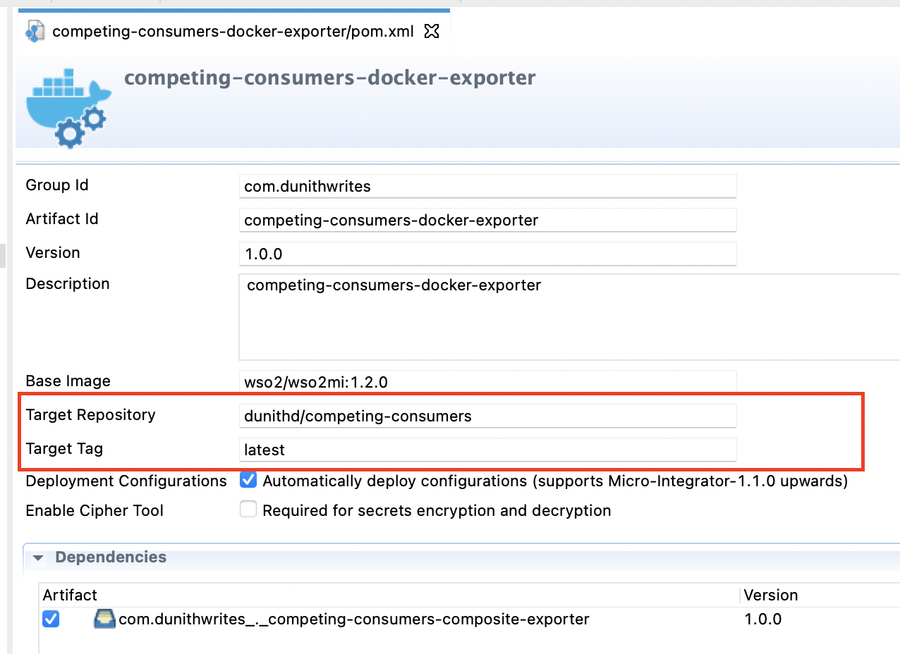

# Implementing Competing Consumers Pattern with WSO2 Micro Integrator and RabbitMQ

This reposity contains the source code for the [Competing Consumers](https://medium.com/event-driven-utopia/competing-consumers-pattern-explained-b338d54eff2b) pattern implementation that is described in the following article.

https://medium.com/sa-team-blog/implementing-competing-consumers-pattern-with-wso2-micro-integrator-and-rabbitmq-d12034272c71

## Prerequisites

1. [Docker and Docker Compose](https://docs.docker.com/compose/)
2. [WSO2 Integration Studio](https://wso2.com/integration/integration-studio/)
3. Maven
4. Git (optional)

## Step 1 - Import the project into Integration Studio
The Integration Studio is the recommended tooling for WSO2 platform products as it provides a rich user experience for creating integration artefacts, debugging, and generating Docker and Kubernetes projects.

The repository contains an Integration Studio project called **competing-consumers**. Go ahead and import it into the Integration Studio by selecting **File -> Import -> Import Existing WSO2 Project into Workspace**.

Once you import the project, you'll see three modules as follows.
- **competing-consumers-configs** 
Contains MI artefacts for consuming messages from RabbitMQ.
- **competing-consumers-composite-exporter** 
Packages the above artifact module as a - deployable Composite Application Archive (CAR) file.
- **competing-consumers-docker-exporter**  
An auto-generated Docker project for the module (2). Once built, this module produces a Docker image of a MI instance that consumes messages from RabbitMQ. Required MI configurations are kept in the deployment.toml file inside this module. Once built, it'll be added to the image.

## Step 2 - Building the project

Before running the docker-compose, you need to build the **competing-consumers-docker-exporter** module to generate a local Docker image. 

Double click on the **pom.xml** inside **competing-consumers-docker-exporter** project to open the properties page as shown below. Change the `Target Repository`, `Target Tag`, and other parameters accordingly.




Then, right-click on the module and select **Build Docker Image** option to commence the image build process. 

After a successful build, you'll see a local image generated as follows.


## Step 3 - Running the project

### 3.1 Start the project

Open a terminal and navigate to the place where you cloned the Git repository mentioned in the prerequisites.

Execute the following command to start the project.

```bash
docker-compose up --scale consumer=2
```

Here, we are using the `--scale consumer=2` flag to create two replicas of the  `consumer` service which deploys a MI container.

Type `docker ps` to make sure that three containers are up and running. 

Login to RabbitMQ management console using http://localhost:15672 and notice that there are two consumers for a queue called **tasks**. Those are the two MI containers connected and waiting for messages.


### 3.2 Publish some messages into the queue

In this example, we don't have a message producer. To keep things simple, let's publish some messages through the RabbitMQ management console.

Click on **Publish message** and copy and paste the following sample message. Also, add a property called `content_type` with the value `application/xml`.

Sample message:

```xml
<Message>
    <ID>1</ID>
</Message>
```


Click on **Publish Message**.

Repeat the process to send 4–5 messages to the tasks queue. Use 1,2,3,4,5 as message IDs. 

Then you'll notice the following lines printed in the docker-compose logs.


That indicates that RabbitMQ has dispatched messages between two consumers in a round-robin manner. **consumer_1** received all the odd numbers while **consumer_2** received even numbers.

